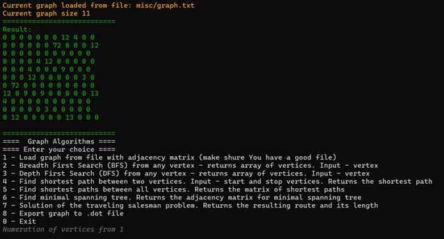
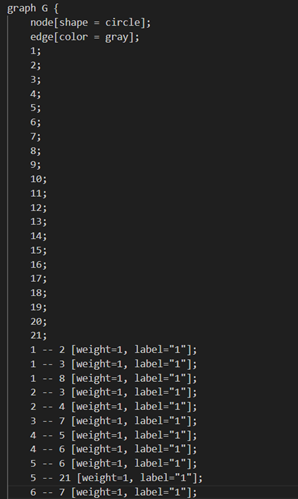

# Graph Algorithms Library in C++

This project is a C++20 static library suite for working with graphs. It includes implementations for basic graph traversal, shortest path algorithms, minimum spanning tree computation, and solving the Traveling Salesman Problem (TSP) using the ant colony algorithm.



## Authors  
School 21 students:   
- [Montoyay](https://t.me/tdutanton)  
- [Buggkell](https://t.me/a_a_sorokina)  

The project consists of two core libraries:
- `s21_graph`: a basic graph representation based on an adjacency matrix.
- `s21_graph_algorithms`: a collection of graph algorithms built on top of `s21_graph`.

## 📁 Repository Structure

- `src/` — source code for both libraries.
- `tests/` — unit tests for all modules.
- `Makefile` — build and test automation.
- `main.cpp` — console interface for interacting with the graph libraries.

---

## 📌 Features

### Part 1: Depth-First and Breadth-First Search

#### Library s21_graph

- Written in **C++20**, following **Google Style Guide**.
- Represented by the class `Graph`, which internally uses a dynamically sized **adjacency matrix**.
- Graph can be loaded from a text file using:
  ```cpp
  void LoadGraphFromFile(std::string filename);
  ```
- Graph can be exported in `.dot` format for visualization:
  ```cpp
  void ExportGraphToDot(std::string filename);
  ```
    

#### Library: `s21_graph_algorithms`

- Implements graph traversal algorithms independently of the internal structure of `Graph`.
- Traversal algorithms:
  - `std::vector<int> DepthFirstSearch(Graph& graph, int start_vertex);`
    - Non-recursive DFS using a **custom stack implementation**.
  - `std::vector<int> BreadthFirstSearch(Graph& graph, int start_vertex);`
    - BFS using a **custom queue implementation**.

#### Custom Data Structures

Two additional static libraries are implemented:
- `Stack` with methods: `Push`, `Pop`, `Top`, etc.
- `Queue` with methods: `Push`, `Pop`, `Front`, `Back`, etc.

---

### Part 2: Shortest Path Algorithms

Implemented in `GraphAlgorithms`:

- **Dijkstra's Algorithm**:
  ```cpp
  int GetShortestPathBetweenVertices(Graph& graph, int vertex1, int vertex2);
  ```

- **Floyd-Warshall Algorithm**:
  ```cpp
  std::vector<std::vector<int>> GetShortestPathsBetweenAllVertices(Graph& graph);
  ```

---

### Part 3: Minimum Spanning Tree

- **Prim’s Algorithm** for MST:
  ```cpp
  std::vector<std::vector<int>> GetLeastSpanningTree(Graph& graph);
  ```

---

### Part 4: Traveling Salesman Problem

- **Ant Colony Algorithm**:
  ```cpp
  TsmResult SolveTravelingSalesmanProblem(Graph& graph);
  ```

  ```cpp
  struct TsmResult {
      std::vector<int> vertices; // The optimal route
      double distance;           // Total route length
  };
  ```

---

### Part 5: Console Interface

A terminal-based app is provided (`main.cpp`) to demonstrate and test the libraries. It includes:

1. Loading a graph from a file.
2. Running BFS and DFS traversals.
3. Finding shortest paths (single pair and all pairs).
4. Computing the minimum spanning tree.
5. Solving the TSP with route and length output.

---

## 🛠️ Build Instructions

Use the provided `Makefile` to compile and test the project.

### Common Targets:

- `make all` — clean, build libraries, and run tests
- `make s21_graph` — build only `s21_graph.a`
- `make s21_graph_algorithms` — build only `s21_graph_algorithms.a`
- `make test` — run unit tests
- `make clean` — remove build artifacts

To build and run the console app manually:
```bash
g++ main.cpp -L. -l:s21_graph.a -l:s21_graph_algorithms.a -o graph_app
./graph_app
```

---

## ✅ Unit Tests

All public methods of both libraries are covered with unit tests. You can run them using:
```bash
make test
```

---

## 🧠 Assumptions

- Graph vertices are numbered starting from `1`.
- Graph input files must contain an adjacency matrix.
- Algorithms assume valid input; invalid inputs are handled gracefully with error messages.

---


## Installation

1. Clone the repository:
```bash
   git clone <repository-link>
   cd <repository-link>
```  

2. Install:
```bash
	cd src
  make install 
```  
  (maybe You don't want to install to /usr/local... - add DESTDIR=<your_path>)

3. Run:
```bash
	make run
```  

4. Uninstall:
```bash
	make uninstall
```  
  (add DESTDIR=<your_path> if needed)

## Other functions

Also there's some other functions which You can use. You should be in the src folder.

1. Testing:
```bash
	make tests
```

2. Valgrind testing:
```bash
	make valgrind_test
```  

3. Make archive with program:
```bash
	make dist
```  

4. Make documentation with html and pdf versions (making new folder - documentation):
```bash
	make dvi
```  

5. Make gcov report with coverage report (making new folder - report):
```bash
	make gcov_report
```  

6. Make UML-diagram:
```bash
	make uml_diagram
```

## Authors

School 21 students: 

- [Buggkell](https://t.me/a_a_sorokina)
- [Montoyay](https://t.me/tdutanton)

2025  